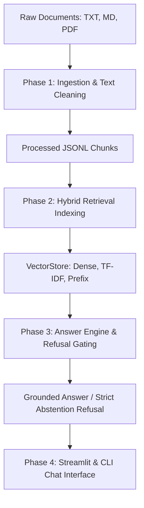

# Knowledge Assistant — Problem Statement 4

Knowledge Assistant is an enterprise-grade AI knowledge retrieval and question-answering system powered by a modular Retrieval-Augmented Generation (RAG) architecture.

---

## System Architecture



---

## Team Responsibilities & Ownership

| Member | Branch | Assigned Phase | Ownership |
|---|---|---|---|
| **Member 1 (@harivarman-007)** | `feature/ingest-eval` | **Phase 1: Document Ingestion + Evaluation** | `src/config.py`, `src/ingest.py`, `tests/test_ingest.py`, `evaluation/eval_questions.jsonl`, `docs/ingestion.md` |
| **Member 2 (@mrdark5133)** | `feature/retriever` | **Phase 2: Embeddings & Hybrid Retrieval** | `src/embed_store.py`, `src/retriever.py`, `tests/test_retriever.py`, `docs/retrieval.md` |
| **Member 3 (@irfanbasha11012007-max)** | `feature/answer-engine` | **Phase 3: Answer Engine + Grounding + Abstention** | `src/answer_engine.py`, `tests/test_answer_engine.py`, `docs/answer_engine.md` |
| **Member 4 (@haygen04)** | `feature/chat-ui` | **Phase 4: Chat UI + Integration + Evaluation** | `src/chat_app.py`, `evaluation/run_eval.py`, `tests/test_integration.py`, `docs/demo_walkthrough.md` |

---

## Phase 1 Implementation Summary (Member 1: @harivarman-007)
- Multi-format document loaders: **Plain Text (`.txt`)**, **Markdown (`.md`)**, **PDF (`.pdf`)**.
- Comprehensive text cleaning: Unicode NFKC normalization, zero-width stripping, line break standardization.
- Recursive character chunker with hierarchical separators and natural boundary overlap.
- Section/header extraction with ancestor hierarchy tracking.
- Precise character offsets (`start_char`, `end_char`) and PDF page number mappings.
- Ingestion CLI with rich statistics export (`python -m src.ingest`).
- Benchmark evaluation dataset with in-scope and out-of-scope/adversarial question suites (`evaluation/eval_questions.jsonl`).

---

## Phase 2 Implementation Summary (Member 2: @mrdark5133)
- **Embedding Models**: Abstract `BaseEmbeddingModel`, `TfidfEmbeddingModel` with sublinear TF and n-grams, and deterministic `LocalDenseEmbeddingModel`.
- **VectorStore**: In-memory and persistent vector storage with $L_2$ unit normalization and $O(N)$ top-$k$ similarity search.
- **Index Rebuilder CLI**: `python -m src.embed_store` for end-to-end JSONL chunk vectorization and disk serialization.
- **Hybrid Retrieval Engine**: `HybridRetriever` fusing dense cosine similarity ($W=0.6$), sparse keyword frequency ($W=0.3$), and prefix matching ($W=0.1$).
- **Confidence Calibration & Threshold Gating**: Probabilistic confidence scaling in $[0.0, 1.0]$ with automatic rejection of out-of-scope queries.
- **Context Formatter**: Structured Markdown prompt assembly with document, section, and page citation provenance.
- **Test Suite**: 14 tests in `tests/test_retriever.py` covering embedding generation, persistence roundtrip, ranking, and threshold gating.

---

## Phase 3 Implementation Summary (Member 3: @irfanbasha11012007-max)
- **Answer Engine Core**: `AnswerEngine` orchestrating grounded generation from retrieved context.
- **Anti-Hallucination Guardrails**: Strict policy where the model **NEVER guesses**. If context is insufficient or confidence < 0.20, returns:
  > `"I don't have that information in the provided material."`
- **Context Sufficiency Verifier**: Validates keyword topical overlap before generation.
- **Citation Provenance Model**: `Citation` dataclass extracting inline tags e.g. `[Source 1: guide.md | Section: Setup | Page: 1]`.
- **Resilient LLM Client**: `LLMClient` supporting OpenRouter / OpenAI with deterministic temperature 0.0, strict timeouts, and exponential backoff retry.
- **Deterministic Offline Synthesizer**: Extractive fallback for offline testing or network disruptions.
- **Prompt Injection Defense**: Sanitization and neutralization of adversarial instructions and delimiter overrides.
- **Test Suite**: 13 unit and integration tests in `tests/test_answer_engine.py` (49 tests passing repository-wide).

---

## Phase 4 Implementation Summary (Member 4: @haygen04)
- **Unified CLI Entrypoint**: Interactive terminal chat loop with `rich` console panels, metadata grid, and citation table layouts (`python -m src.chat_app --mode cli`).
- **Interactive Streamlit Web Playground**: Premium glassmorphic dark theme and Outfit typography custom CSS.
- **Visual Refusal Alerts**: Explicit color border panels separating Grounded Answers (green) from Refusals/Abstentions (red).
- **Interactive Threshold Tuning**: Real-time slider controlling retrieval confidence gating limits.
- **Knowledge Base Inspector**: Tab-based diagnostic page showing chunk dataframe and sandbox retriever query testbeds.
- **Dynamic Index Rebuilder**: Sidebar button to rebuild ingestion and vector indexing pipeline automatically.
- **Benchmark Evaluation Runner**: Evaluates coverage and calculates Refusal Precision, Recall, and F1 scores against gold standard dataset.
- **Test Suite**: Multi-phase end-to-end integration tests (`tests/test_integration.py`). All 50 tests pass repository-wide.

---

## Quick Start

### Installation
```bash
python -m pip install pytest pypdf scikit-learn numpy streamlit rich
```

### Running Ingestion & Indexing
```bash
# 1. Ingest raw documents into structured JSONL chunks
python -m src.ingest --input data/raw --output data/processed/chunks.jsonl --stats

# 2. Build persistent vector store index
python -m src.embed_store --input data/processed/chunks.jsonl --output data/index --model tfidf
```

### Launching the Application
```bash
# Streamlit Web UI Mode
streamlit run src/chat_app.py --mode streamlit

# Terminal CLI Mode
python -m src.chat_app --mode cli
```

### Running Benchmark Evaluations
```bash
python -m evaluation.run_eval --dataset evaluation/eval_questions.jsonl --output evaluation/report.json
```

### Running Tests
```bash
python -m pytest -v
```
