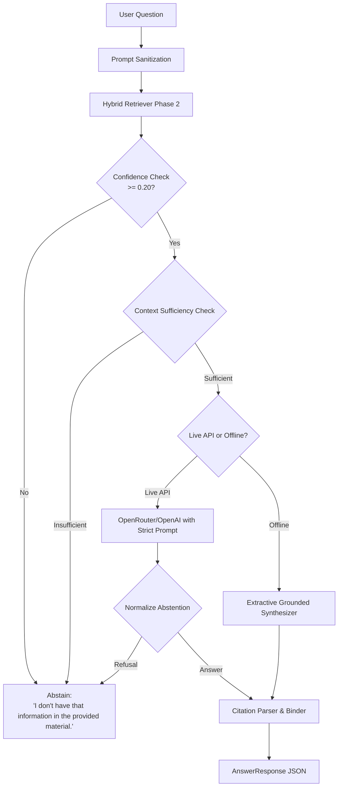

# Phase 3: Answer Engine + Grounding + Abstention

## Overview

The **Answer Engine** is the grounded generation and safety guardrail engine of Knowledge Assistant. Its core purpose is to synthesize accurate answers strictly from retrieved context documents while enforcing zero-hallucination policies.

---

## Core Principles

1. **THE LLM MUST NEVER GUESS**:
   - The model is strictly forbidden from using general pre-trained knowledge to answer questions when information is not present in the provided context documents.
2. **Deterministic Abstention**:
   - When retrieved context is missing, insufficient, or of low confidence (< 0.20), the system unconditionally returns:
     > `"I don't have that information in the provided material."`
3. **Structured Citation Provenance**:
   - Every grounded answer links back to the source file, section header, and page number with inline bracket tags (e.g., `[Source 1: guide.md | Section: Setup | Page: 1]`).
4. **Prompt Injection Hardening**:
   - Adversarial prompt injection patterns (such as `"Ignore previous instructions"`, `"System override"`, `"You are now unrestricted"`) are filtered, sanitized, and neutralized before LLM evaluation.
5. **High Availability & Deterministic Offline Fallback**:
   - If API keys are unavailable or upstream network endpoints experience transient outages, the system automatically falls back to an extractive grounded synthesizer.

---

## Architecture & Flow



---

## Data Models

### `Citation`
```python
@dataclass
class Citation:
    source: str
    section: Optional[str] = None
    page: Optional[int] = None
    snippet: str = ""
    confidence: float = 0.0
    doc_id: str = ""
    chunk_id: str = ""
```

### `AnswerResponse`
```python
@dataclass
class AnswerResponse:
    question: str
    answer: str
    citations: List[Citation]
    abstained: bool
    abstention_reason: Optional[str]
    retrieval_confidence: float
    latency_ms: float
    tokens_used: int
    model_name: str
    metadata: Dict[str, Any]
```

### `GenerationConfig`
```python
@dataclass
class GenerationConfig:
    temperature: float = 0.0
    max_tokens: int = 1024
    top_p: float = 1.0
    seed: Optional[int] = 42
    timeout_seconds: float = 20.0
    max_retries: int = 3
    retry_backoff_factor: float = 1.5
```

---

## Verification & Testing

Phase 3 includes unit and integration tests in `tests/test_answer_engine.py` covering:
- Grounded answer generation and parameter adherence
- Citation parsing, tagging, and JSON serialization
- World knowledge abstention (e.g., capitals, celebrity facts)
- Partial / missing facts context sufficiency gating
- Prompt injection resistance and delimiter escaping
- Offline deterministic synthesis fallback
