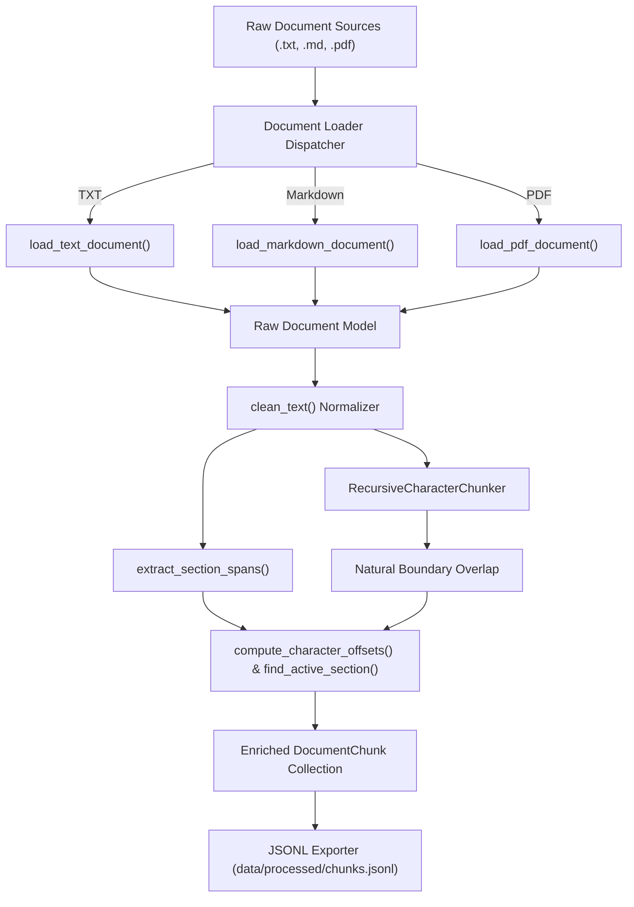

# Document Ingestion & Evaluation Pipeline

The **Knowledge Assistant Ingestion Pipeline** processes multi-format document sets (Plain Text, Markdown, and PDF) into structured, contextualized text chunks with precise character offsets, section metadata, and provenance tracking.

---

## 1. Pipeline Architecture



---

## 2. Key Components

### 2.1 Document Loaders
- **Plain Text (`.txt`, `.text`)**: Robust multi-encoding fallback (`utf-8`, `utf-8-sig`, `latin-1`, `cp1252`).
- **Markdown (`.md`, `.markdown`)**: YAML frontmatter parsing, header hierarchy discovery (`#` to `######`), title extraction.
- **PDF (`.pdf`)**: Page-by-page text extraction via `pypdf`, page boundary offset tracking, and PDF document metadata extraction.

### 2.2 Text Cleaning & Normalization
- **Unicode Normalization**: NFKC normalization, strips zero-width spaces (`\u200b`, `\u200c`, `\u200d`, `\ufeff`) and converts non-breaking spaces (`\u00a0`).
- **Line Ending Standardization**: Converts `\r\n` and `\r` to unified `\n`.
- **Whitespace Sanitation**: Collapses excessive horizontal whitespace and reduces 3+ consecutive newlines to 2.

### 2.3 Recursive Character Chunker
Uses a prioritized separator hierarchy:
1. `\n\n# ` (H1 Markdown header)
2. `\n\n## ` (H2 Markdown header)
3. `\n\n### ` (H3 Markdown header)
4. `\n\n` (Paragraph break)
5. `\n` (Line break)
6. `. `, `? `, `! ` (Sentence boundary)
7. ` ` (Word boundary)
8. `""` (Character fallback)

### 2.4 Chunk Overlap
When transitioning across chunks, a trailing slice up to `chunk_overlap` characters is extracted and aligned to the nearest natural word or sentence delimiter.

### 2.5 Character Offsets & Section Metadata
- **Character Offsets**: Each chunk calculates exact `start_char` and `end_char` within the document.
- **Section Metadata**: Each chunk tracks its `section_header` and `section_hierarchy` trail (e.g. `["Ingestion", "Loaders"]`).
- **PDF Page Mapping**: Offsets are mapped to `page_number` for citation precision.

---

## 3. Configuration & CLI Usage

### 3.1 CLI Ingestion
```bash
# Ingest entire raw directory
python -m src.ingest --input data/raw --output data/processed/chunks.jsonl --chunk-size 500 --chunk-overlap 50 --stats

# Ingest single file
python -m src.ingest --input docs/sample.md --output data/processed/chunks.jsonl --stats
```

### 3.2 CLI Options
| Argument | Flag | Default | Description |
|---|---|---|---|
| `--input` | `-i` | `data/raw` | Path to document file or directory |
| `--output` | `-o` | `data/processed/chunks.jsonl` | Output JSONL file destination |
| `--chunk-size` | `-c` | `500` | Max character length per chunk |
| `--chunk-overlap` | `-v` | `50` | Overlap character count between chunks |
| `--min-chunk-length` | | `20` | Minimum character length for valid chunk |
| `--recursive` | | `True` | Recursively scan directory subfolders |
| `--stats` | | `False` | Print summary statistics table |
| `--log-level` | | `INFO` | Logging verbosity (DEBUG, INFO, WARNING, ERROR) |

---

## 4. Chunk Schema (JSONL)

```json
{
  "chunk_id": "guide_a1b2c3d4#chunk_0000",
  "doc_id": "guide_a1b2c3d4",
  "text": "The ingestion pipeline processes TXT, Markdown, and PDF documents into structured chunks.",
  "start_char": 0,
  "end_char": 90,
  "chunk_index": 0,
  "section_header": "Overview",
  "source": "docs/guide.md",
  "char_count": 90,
  "word_count": 13,
  "metadata": {
    "file_name": "guide.md",
    "file_extension": ".md",
    "file_size_bytes": 1024,
    "doc_type": "markdown",
    "section_hierarchy": ["Getting Started", "Overview"],
    "chunk_index": 0,
    "total_chunks": 4
  }
}
```

---

## 5. Evaluation Dataset

The evaluation dataset (`evaluation/eval_questions.jsonl`) contains standardized benchmark questions:
- **In-scope questions**: Factual, procedural, multi-hop, and comparative queries with expected answers, key entities, and difficulty levels.
- **Out-of-scope & adversarial questions**: Queries with `is_in_scope: false`, `is_answerable: false`, rejection reasons, and expected fallback responses.
