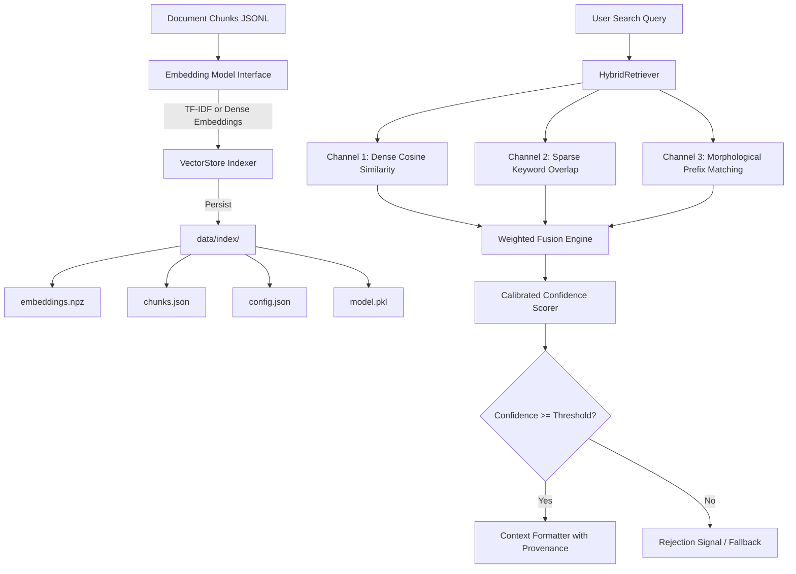

# Phase 2 — Embeddings, Vector Store, and Hybrid Retrieval

## Overview
Phase 2 implements the semantic and lexical retrieval engine for the Knowledge Assistant. It indexes preprocessed document chunks produced by Phase 1, computes dense and sparse vector embeddings, maintains an in-memory and disk-persistent vector store, and provides hybrid multi-channel retrieval with calibrated confidence gating.

---

## Architectural Workflow



---

## Key Modules & Components

### 1. Embedding Models (`src/embed_store.py`)
- `BaseEmbeddingModel`: Abstract base class defining `embed_documents()` and `embed_query()`.
- `TfidfEmbeddingModel`: Sublinear TF-IDF sparse-to-dense embedder with n-gram `(1, 2)` support and $L_2$ unit normalization.
- `LocalDenseEmbeddingModel`: Deterministic subword and hash-based dense semantic projection model (default dimension 384) with zero external dependency requirements.
- `get_default_embedding_model(model_type, **kwargs)`: Factory helper.

### 2. Vector Store & Serialization (`src/embed_store.py`)
- `VectorStore`: In-memory storage backed by a contiguous $[N, D]$ NumPy matrix.
- Vector Normalization: $L_2$ row normalization allows computing exact cosine similarities using fast BLAS dot products.
- `similarity_search(query, top_k, min_score)`: $O(N)$ partitioned top-$k$ retrieval.
- `batch_similarity_search(queries, top_k)`: Vectorized batch evaluation across multiple queries.
- `save(directory)` & `load(directory)`: Clean serialization to disk:
  - `embeddings.npz`: Compressed NumPy embedding matrix.
  - `chunks.json`: Structured document chunk metadata.
  - `config.json`: Store hyperparameters and index timestamp.
  - `model.pkl`: Serialized vocabulary and vectorizer state.

### 3. Hybrid Retriever & Scoring Fusion (`src/retriever.py`)
- `HybridRetriever`: Combines three complementary retrieval channels:
  1. **Dense Vector Channel ($W=0.6$)**: Semantic matching via cosine similarity.
  2. **Keyword Channel ($W=0.3$)**: Term coverage ratio and exact phrase match bonus.
  3. **Prefix Channel ($W=0.1$)**: Stem and morphological variation matching.
- **Score Fusion**:
  $$S_{\text{hybrid}} = 0.6 \cdot S_{\text{dense}} + 0.3 \cdot S_{\text{kw}} + 0.1 \cdot S_{\text{prefix}}$$

### 4. Confidence Calibration & Threshold Gating (`src/retriever.py`)
- Non-linear confidence scaling maps raw similarities into calibrated probability estimates in $[0.0, 1.0]$:
  $$\text{Confidence} = 1.0 - e^{-2.2 \times S_{\text{hybrid}}}$$
- Out-of-domain and adversarial questions failing the threshold ($< 0.15$) trigger `is_confident = False` with explicit rejection reasons.

### 5. Structured Context Formatter (`src/retriever.py`)
- `format_context(hits, max_characters)`: Constructs Markdown prompt blocks containing chunk text and complete citation provenance:
  ```markdown
  ### [Source 1: user_manual.pdf | Section: Installation | Page: 4 | Score: 0.88]
  Follow these steps to configure the system...
  ```

---

## CLI Usage

### Indexing Processed Chunks
```bash
python -m src.embed_store --input data/processed/chunks.jsonl --output data/index --model tfidf
```

### Running Retrieval Tests
```bash
python -m pytest tests/test_retriever.py -v
```
