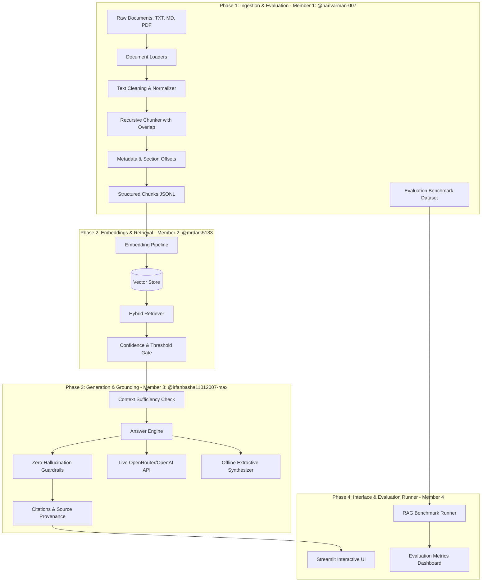

# Project Plan: Knowledge Assistant (Problem Statement 4)

## Architecture Overview

## Phase Breakdown

1. **Phase 1: Document Ingestion + Evaluation (Completed - Member 1: @harivarman-007)**
   - Configuration management (`src/config.py`)
   - Document loaders for TXT, MD, and PDF (`src/ingest.py`)
   - Text cleaning, normalization, and zero-width filtering
   - Recursive character chunker with sliding window overlap
   - Section hierarchy and character offset computation
   - Ingestion CLI with statistics (`python -m src.ingest`)
   - Comprehensive test suite (`tests/test_ingest.py`)
   - In-scope and out-of-scope evaluation questions (`evaluation/eval_questions.jsonl`)
   - Ingestion workflow documentation (`docs/ingestion.md`)

2. **Phase 2: Embeddings & Vector Search (Completed - Member 2: @mrdark5133)**
   - Abstract embedding interface and concrete models (`BaseEmbeddingModel`, `TfidfEmbeddingModel`, `LocalDenseEmbeddingModel`)
   - Persistent VectorStore with L2 normalization and cosine similarity (`VectorStore`)
   - Index building and rebuilder CLI (`python -m src.embed_store`)
   - Hybrid retriever with 3-channel scoring: dense, sparse keywords, prefix matching (`HybridRetriever`)
   - Non-linear confidence score calibration and threshold gating
   - Structured context assembly with provenance citations (`format_context`)
   - Unit & integration test suite (`tests/test_retriever.py`)
   - Retrieval architecture documentation (`docs/retrieval.md`)

3. **Phase 3: Answer Engine + Grounding + Abstention (Completed - Member 3: @irfanbasha11012007-max)**
   - Answer Engine core orchestrator (`src/answer_engine.py`)
   - Strict zero-hallucination system prompt and context encapsulation
   - Standard exact abstention response (`"I don't have that information in the provided material."`)
   - Multi-tier guardrails: confidence gating (<0.20), keyword context sufficiency, prompt injection sanitization
   - Live LLM client with timeout and exponential backoff retry loop
   - High-reliability offline grounded extractive synthesizer fallback
   - Structured citation provenance mapping (`Citation`, `parse_and_bind_citations`)
   - 13 comprehensive unit & integration tests (`tests/test_answer_engine.py`)
   - Technical grounding documentation (`docs/answer_engine.md`)

4. **Phase 4: UI & End-to-End Evaluation (Member 4)**
   - Streamlit user interface
   - Automated evaluation suite runner
   - Precision, recall, and groundedness metrics reporting
